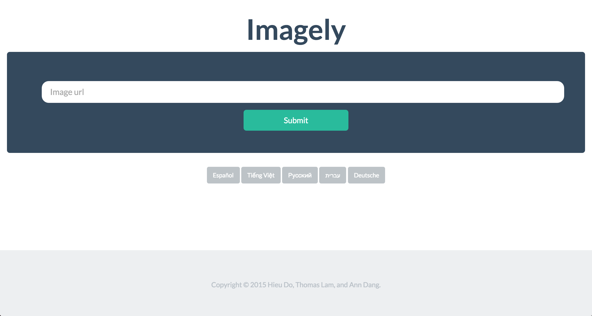

# imagely

##Inspiration
We believe that image-based word associations is a powerful language learning tool. Nobody ever learns a new language using just a plain dictionary. We hope to make the process of learning a new language much easier for non-native speakers (and fun) through this web app.

##What it does
Using Clarify's powerful image recognition system, the web app retrieves words associated with the image url inputed by the user. It then uses Yandex translation API to translate those words into a language of the user's choice. Current supported languages are: Spanish, Russian, Vietnamese, Dutch and Hebrew.

##How I built it
We use the MEAN stack to build this web app.

##Challenges I ran into
The Yandex API calls only accept one word at a time. We needed to stringify our results to avoid expensive http calls for every word associated with an image url

##Accomplishments that I'm proud of
We made a complete project utilizing 2 APIs.

##What I learned
Angular.js is a pain.

##What's next for imagely
We plan to finish the quiz mode for our web app since memory retention is important in language learning. We also want to implement authentication system to ensure personalized user experience as well as possible social network integration aspect.

##Built With
`javascript`
`css`
`html`
`ruby`

*Preview:*

Built at hackNY 2015 
